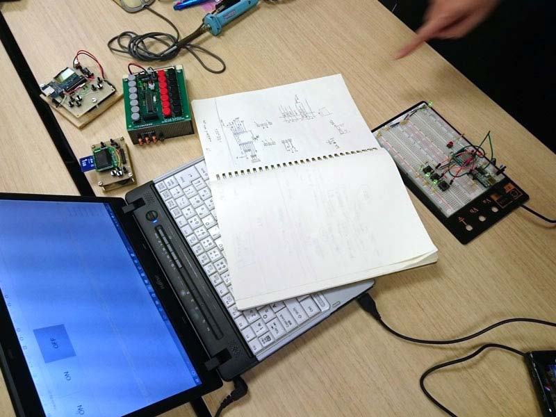
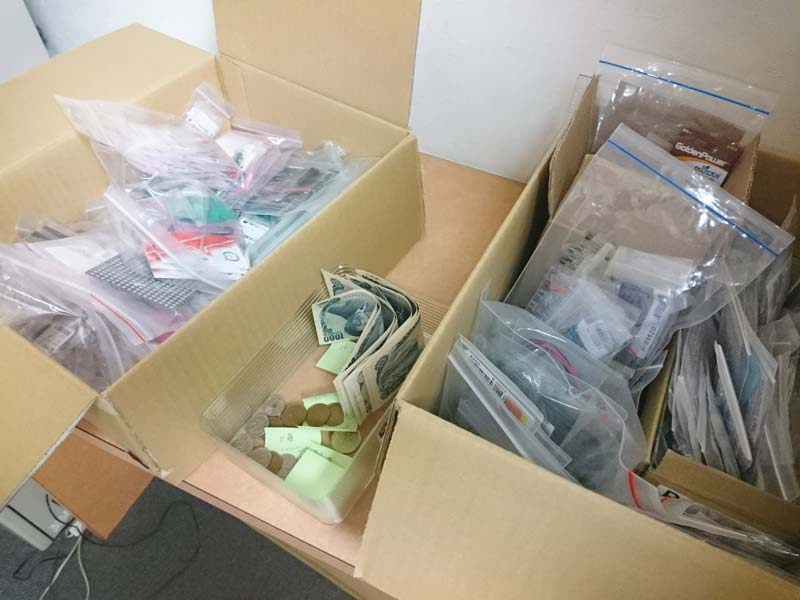
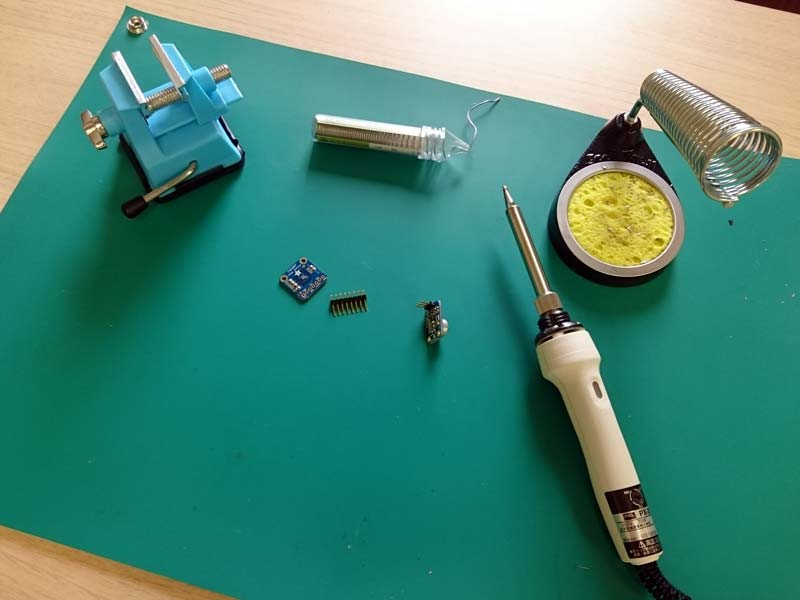

## IoT開発合宿・勉強会

未踏クリエイター（現役およびOB）のみ参加可能な合宿および勉強会です。開催は不定期で、合宿は主に都内のホテルにて、金曜日夜から日曜日昼までの2泊3日で、勉強会は週末に日帰りで開催しています。

ソフトウェア技術者の多い未踏エンジニアがハードウェア技術を身につけ、IoTデバイス、スマートデバイス等の新たな分野を開拓する、という目標で実施しています。
これを達成するために、参加者各自が新しい技術を存分に実践できるよう、以下のような工夫をしています。

- 会期中の出来事は他言無用、他参加者の作品をコピーすることは禁止
  - 新たな知的財産が生まれる可能性に配慮しています。
- （合宿のみ）参加者が自由に使える部品とはんだごてを会場に用意
  - その場で思いついたアイディアのプロトタイピングや、持ち込んだプロジェクトが破損した場合の修理が容易に行えます。
- （合宿のみ）ハードウェア初心者向けの講習を実施
  - 会期前半に集中講義を行うことで、後半はじっくり実践して理解を深められます。
- 会期中の成果を求めない（ハッカソンではない）
  - 新しいアイディアを練るほかに、手持ちの長期プロジェクトで困っていることを他の参加者に相談して、プロジェクトのブーストを行うこともできます。

現在までに合宿は3回、勉強会は2回開催し、それぞれ10名前後の未踏クリエイターが参加しました。参加者のハードウェアに対する知識レベルは様々で、ハードウェアを触るのが初めてという参加者から、ハードウェアが本業という参加者まで、幅広いメンバーが毎回集まっています。

幅広いメンバーが集まり、メンバー総合での知識の幅も広いことから、疑問点や課題、抱えている問題等が何でもすぐに解決する、という点で参加者の好評を得ています。また、合宿では土曜日1日をまるまる開発の時間に充てられることも好評です。ノートPCを開けばすぐ開発できるソフトウェアと違い、ハードウェア開発はセットアップと片付けに時間がかかるので、日帰り勉強会では、開発よりも情報交換や新技術のキャッチアップに重点を置いています。

## 現在までの記録

- 第1回合宿 2016年06月
- 第2回合宿 2016年09月
- 第3回合宿 2017年06月

- 第1回勉強会 2016年11月
- 第2回勉強会 2017年07月

会場には晴海グランドホテルやテックショップジャパン、会場に用意する電子部品にはスイッチサイエンスのエイドステーションを利用しました。

